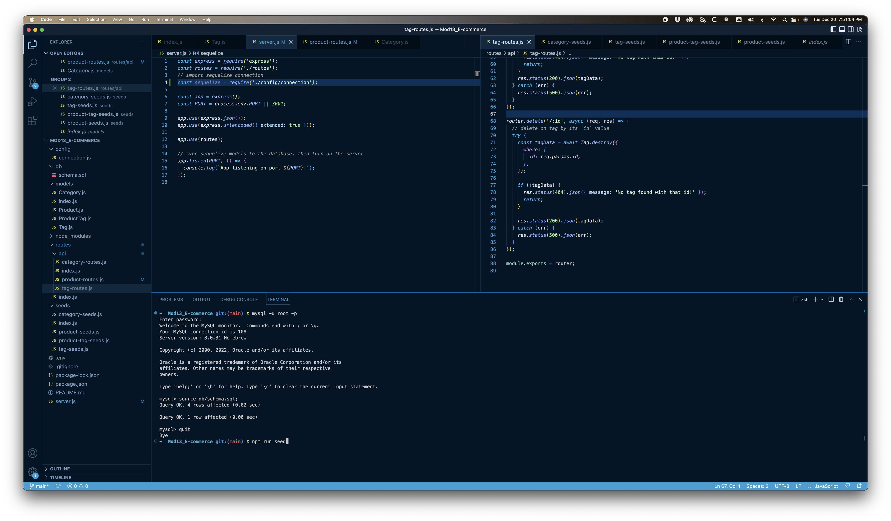

# E-commerce Backend App

This is the back end of **an e-commerce site**.

## Table of Contents

- [Background](#background)
- [Install](#install)
- [Usage](#usage)
- [Screenshot](#screenshot)
- [Maintainers](#maintainers)
- [Contributing](#contributing)
- [Contributors](#contributors)
- [License](#license)

## Background

*To understand the fundamental architecture of e-commerce sites,* we were instructed to build the back end of one. This may not be applicable right out of the box, but was a good exercise as a starting point for understanding how e-commerce sites work.

## Install/Link to Webpage 🔗 

Check out the link to the walkthrough video:

https://youtu.be/Dmg_JWbH5pQ

And here's the repo link!:

https://github.com/dbedrossian/Mod13_E-commerce

## Usage

This is being used as an assignment project.

## Screenshot

## Maintainers

[@Danny Bedrossian](https://github.com/dbedrossian).

## Contributing

Feel free to dive in! [Open an issue](https://github.com/dbedrossian/standard-readme/issues/new) or submit PRs.

## Contributors

Thanks to Sebastian from the AskBCS chat.

## License

© Danny Bedrossian